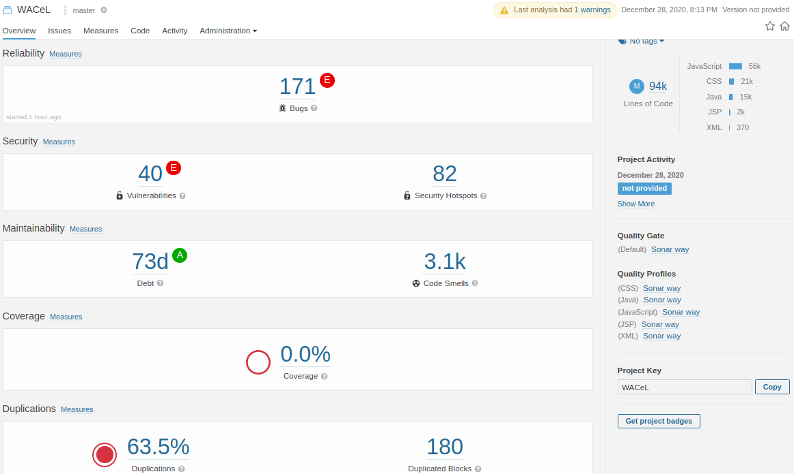

# Análisis estático

# Prácticas de Clean Code
* Indentación
* Agrupación de código
* Evitar la anidación profunda (Avoid Deep Nesting)

# Refactoring

## Factory
### Función PosTagImprover.java
Eliminación de algunos comentarios innecesarios.\
Uso de bucles for en lugar de las condicionales if para un mejor orden en el código, asi como la creación de más objetos ArrayList.

´´´java
for(int i = 0; i < allNouns.size(); i++ ){
	CustomToken noun = allNouns.get(i);
	//GIVEN (Antecedent)
	if(SpecialVerb.NOUNS_AND_VERBS_HASH.containsKey(noun.getStem()) && !tokens.get(allNouns.get(i).getIndex()).isConfirmedNoun()) {
		//WHEN
		//Previous Tokens (contains POS tags:)
		String regexprevpostags = "(^|.*CC)$";
		String prevPOSs = getPosTagsAsString(tokens, 0, noun.getIndex());
		//Next Tokens (contains POS tags:)
		String regexnextpostags = "^(NN.?\\s+(NN.?|VB.?)).*";
		String nextPOSs = getPosTagsAsString(tokens, noun.getIndex()+1, tokens.size());
		if(prevPOSs.matches(regexprevpostags) && nextPOSs.matches(regexnextpostags)) {
			//THEN (Adjust Token)
			if(noun.getIndex() + 2 < tokens.size() && tokens.get(noun.getIndex() + 2) != null) {
				CustomToken nextToken =  tokens.get(allNouns.get(i).getIndex() + 2);
				String singularNounNext = nextToken.getStem();
				if(nextToken.getPosTag().contains(PosTagEnum.VB.name()) || SpecialVerb.NOUNS_AND_VERBS_HASH.containsKey(singularNounNext)) {
					tokens.get(allNouns.get(i).getIndex()).setConfirmedNoun(true);
				}
			} 										
		}
	}
}
 ´´´

# WACeL-Java
# Automated Analysis of Natural Language Requirements: Scenarios &amp; Lexicons Tool

C&L is a web application (Java, MySql) for editing, visualization and analysis of scenarios. C&L architecture is based on layers style, divided into modules and developed using Domain-driven Design practices. Modules group functionalities to manage users (User), projects (Project), lexicon symbols (Language used in the application - LEL), scenarios (Scenario) and to perform Analysis. The input of the C&L is composed of projects containing scenarios in plain text format. The output is a set of formatted scenarios, where the relationships among scenarios are represented by hyperlinks (It facilitates the navigation between scenarios). Other outputs include: (1) A Petri-Net representing the scenarios and their relationships and (2) a Feedback with detailed information about scenarios analysis.

Scenarios are often described using templates based on Cockburn [1] or scenario language proposed by Leite et al. [2].

[1] A. Cockburn, Writing Effective Use Cases. Addison-Wesley, 2001.

[2] J. C. S. P. Leite, G. Hadad, J. Doorn and G. Kaplan, A scenario construction process, Requirements Engineering Journal, Springer-Verlag London Limited, vol. 5, num. 1, pp. 38-61, 2000.

## Technologies used :

-   Spring Security 5.1.3.RELEASE
-   Spring 5.1.5.RELEASE
-   mysql-connector-java:jar 8.0.16
-   Maven 3
-   Java 8
-   Stanford Core NLP 3.9.2
- 
## Build Instructions

Here are some helpful instructions to use the latest code:

### Build with Eclipse and Maven

1. Make sure you have MySql installed, details here:
    [https://www.mysql.com/downloads/](https://www.mysql.com/downloads/)
2. Create MySql schema "celdb" with user "root" and password "admin"     (change!)

3. Make sure you have Apache Tomcat installed, details here:
    [https://tomcat.apache.org/download-80.cgi](https://tomcat.apache.org/download-80.cgi)  --> Stop tomcat service
     
4. Make sure you have Eclipse IDE for Enterprise Java Developers, details here:     [https://www.eclipse.org/downloads/packages/](https://www.eclipse.org/downloads/packages/)
 
5. Eclipse IDE: Import as maven project (clone!)

6.  Eclipse IDE: Run as -> Maven build -> clean install

7. Eclipse IDE: Run as -> Run on server

8. Initialize (test user and profiles) "celdb": [initialize.sql](https://github.com/edgarsc22/WACeL-Java/blob/master/sqlscript/initialize.sql)

9. Initialize projects from Case Studies (projects and scenarios) in "celdb":  [case_study_projects.sql](https://github.com/edgarsc22/WACeL-Java/blob/master/sqlscript/case_study_projects.sql)

 10. go to http://localhost:8080/WACeL-Java and Test with user "test" and password "123456" (change!)
    
##  Case Studies
  There are some real **projects** in the literature, and as a result, we selected 4 projects to evaluate the _accuracy_ of the heuristics implemented in the C&L tool:      [Case Studies](https://github.com/edgarsc22/WACeL-Java/blob/master/docs/CeL%20and%20Case%20Study.pdf)

- E. Sarmiento, [Towards the improvement of natural language requirements descriptions: the C&L tool](https://dl.acm.org/doi/abs/10.1145/3341105.3374028), In The 35th ACM/SIGAPP Symposium On Applied Computing - SAC, 2020.

- E. Sarmiento, J. C. S. P. Leite, E. Almentero, [Analysis of Scenarios with Petri-Net Models](https://ieeexplore.ieee.org/abstract/document/7328013), In 29th Brazilian Symposium on Software Engineering (SBES), 2015.

- E. Sarmiento, J. C. S. P. Leite, and E. Almentero. [Using correctness, consistency, and completeness patterns for automated scenarios verification](https://ieeexplore.ieee.org/abstract/document/7407737/). 2015 IEEE Fifth International Workshop on Requirements Patterns (RePa). IEEE, 2015.

- E. Sarmiento, J. C. S. P. Leite, and E. Almentero. [C&L: Generating model based test cases from natural language requirements descriptions](https://ieeexplore.ieee.org/abstract/document/6908677/). IEEE 1st International Workshop on Requirements Engineering and Testing, 2014.

- E Sarmiento. [Analysis of Natural Language Scenarios](https://www.maxwell.vrac.puc-rio.br/28193/28193.PDF), Ph.D Thesis, Department  of Informatics, PUC-Rio, Brazil, 2016.
